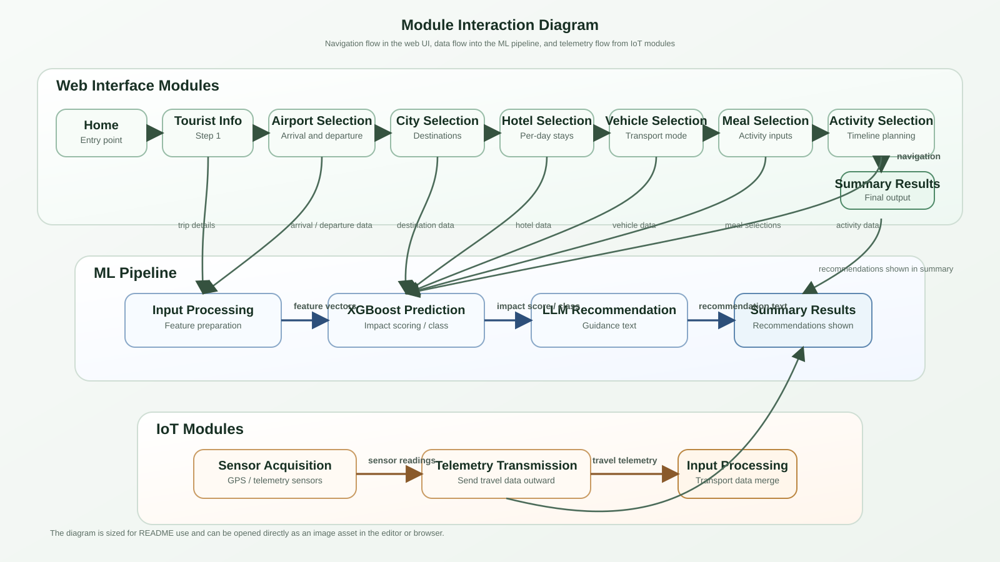

# Sri Lanka Tourist Carbon Footprint Calculator

A full-stack web application for travel agents to record, calculate, and store the carbon footprint of tourist trips across Sri Lanka. Built as a Final Year Project (FYP) by Dakshina Dissanayake, Faculty of Information Technology, Horizon Campus.

---

## Project Overview

This system guides travel agents through a 4-step wizard to capture complete trip details for foreign tourists visiting Sri Lanka. It calculates carbon emissions from hotel stays and on-ground activities using scientifically sourced emission factors, stores trip records in a database, and generates downloadable PDF reports.

Transport emissions are handled by a separate IoT GPS module (developed by a team member). Personalized sustainability recommendations are provided by a separate LLM module (developed by another team member).

---

## System Architecture

```
┌─────────────────────────────────────────────────────┐
│                   Frontend (React)                   │
│  4-Step Wizard → Carbon Calculation → PDF Report     │
│  Live IoT Air Quality Monitor (ESP32 Integration)    │
└──────────────────────┬──────────────────────────────┘
                       │ REST API
┌──────────────────────▼──────────────────────────────┐
│              Backend (Node.js + Express)             │
│         Emission Calculation + SQLite Storage        │
└──────────────────────┬──────────────────────────────┘
                       │
          ┌────────────┴────────────┐
          │                         │
┌─────────▼──────────┐   ┌─────────▼──────────┐
│  IoT GPS Module     │   │   LLM Module        │
│  Transport Emission │   │  Recommendations    │
│  (Team Member)      │   │  (Team Member)      │
└────────────────────┘   └────────────────────┘
```

### Air Quality Monitor (IoT Integration)
The system now features live integration with an **ESP32 + MQ-135 Air Quality Monitor**. 
- Live CO₂ readings, raw ADC, and air quality badges are shown directly inside the travel agent dashboard.
- Features a real-time sparkline history chart.
- Includes exact GPS location fetching (using a GitHub Pages HTTPS helper to bypass mixed-content constraints) and Google Maps links.
- **Hardware Setup**: See `AirQualityMonitor/README.md` for Arduino wiring and flashing instructions.

---

## Module Interaction Diagram



The rendered SVG version is stored in the project root as [module-interaction-diagram.svg](module-interaction-diagram.svg).

---

## Features

### Frontend
- 4-step guided wizard interface
- Tourist profile and trip details intake
- Multi-destination planning with per-day hotel selection (3, 4, and 5-star)
- Per-day hotel star category selection
- Stay days stepper control (+ / − buttons)
- Timed daily activity scheduling with overlap detection
- Color-coded visual activity timeline
- Activity gap indicator (unscheduled time detection)
- Inline edit and remove activities (icon buttons)
- Location-specific day templates (20 locations × 3 templates each)
- One-click template apply with confirmation modal
- Travel legs with vehicle type and fuel type selection
- Already checked-in detection for same hotel multi-day stays
- Days allocation progress bar (sticky)
- Duplicate destination warning
- Inline form validation with red border error indicators
- Custom confirmation modals (no browser alerts)
- Carbon emission calculation (activity + hotel)
- Trip History modal (view, detail, delete saved trips, download PDF)
- Save Report to database with auto emission calculation
- Downloadable A4 PDF report with full emission breakdown
- Fully responsive layout

### Backend
- REST API (Node.js + Express)
- SQLite database (better-sqlite3)
- HTTP request logging (Morgan — file + console)
- Trip save with full emission calculation
- Trip history retrieval
- Single trip detail retrieval
- Trip deletion
- Emission factors API endpoint
- CORS configured for frontend

---

## Project Structure

```
FYP/
├── README.md
├── .gitignore
│
├── index.html
├── package.json
├── styles.css
│
├── src/
│   ├── main.jsx
│   ├── App.jsx
│   ├── data.js
│   └── components/
│       ├── StepOneTripDetails.jsx
│       ├── StepTwoDestinations.jsx
│       ├── StepThreeItinerary.jsx
│       ├── StepFourReport.jsx
│       ├── ConfirmModal.jsx
│       └── TripHistoryModal.jsx
│
└── backend/
    ├── server.js
    ├── database.js
    ├── .env
    ├── package.json
    ├── carbon.db          (auto-generated, git-ignored)
    ├── logs/              (auto-generated, git-ignored)
    └── routes/
        └── trips.js
```

---

## Tech Stack

| Layer | Technology |
|---|---|
| Frontend Framework | React 18 + Vite 5 |
| Styling | Vanilla CSS (no framework) |
| Fonts | DM Sans + Playfair Display (Google Fonts) |
| Backend | Node.js + Express |
| Database | SQLite (better-sqlite3) |
| HTTP Logging | Morgan |
| Environment | dotenv |

---

## Getting Started

### Prerequisites

- Node.js v18 or v20 LTS — https://nodejs.org

### Frontend Setup

```bash
cd "E:\FYP"
npm install
npm run dev
```

Open http://localhost:5173

### Backend Setup

```bash
cd "E:\FYP\backend"
npm install
node server.js
```

Backend runs on http://localhost:5000

---

## The 4-Step Wizard

### Step 1 — Basic Trip Details
Tourist profile (name, email, age, country of origin), travel group info (solo or group, number of tourists), arrival and departure airports with dates and times, and optional rental vehicle details. Total stay days are auto-calculated from the selected dates. Sri Lanka is excluded from the country list as this system targets foreign tourists only.

### Step 2 — Destinations and Hotels
Add multiple Sri Lanka destinations in travel order. Each destination supports star category selection (3, 4, or 5-star), same hotel for all days or per-day hotel selection with individual star categories, and a stepper control for stay days. A sticky progress bar tracks day allocation in real time. Duplicate destination warnings are shown.

### Step 3 — Travel Legs and Daily Activities
Auto-generates travel legs between destinations. Each leg supports vehicle type and fuel type selection separately. For each day, the travel agent records hotel arrival time and adds timed activities. Activities are validated for overlap and displayed on a color-coded visual timeline with gap indicators. One-click location-specific templates pre-fill a full day's activities. Same-hotel continuation days are automatically marked as "Already Checked In."

### Step 4 — Final Report
Displays a complete trip summary with carbon emission breakdown. Reports can be saved to the database and downloaded as an A4 PDF.

---

## Carbon Emission Calculation

Transport emissions (travel legs) are calculated by a separate IoT GPS module and are excluded from this system's output.

This system calculates:

### Activity Emissions
```
emission (kg CO₂) = duration_hours × emission_factor × group_size
```

### Hotel Emissions
```
hotel_hours = 24 - total_activity_hours
emission (kg CO₂) = hotel_factor × (hotel_hours / 24) × group_size
```

### Activity Emission Factors (kg CO₂ per person per hour)

| Activity | Factor | Basis |
|---|---|---|
| Meal | 1.500 | Food consumption and kitchen energy |
| Resting | 0.050 | Hotel electricity baseline |
| Walking | 0.008 | Food supply chain (extra calorie burn) |
| Jogging | 0.025 | Higher calorie burn, food supply chain |
| Hiking | 0.030 | High exertion, food supply chain |
| Bicycle Ride | 0.010 | Moderate effort, food supply chain |
| Swimming / Snorkeling | 0.050 | Physical effort and equipment |
| Surfing | 0.050 | Physical effort and equipment |
| Boat Ride | 0.240 | Motor boat fuel consumption |
| Beach Leisure | 0.050 | Minimal facility use |
| Wildlife Safari | 0.800 | Safari jeep fuel consumption |
| Cultural / Temple Visit | 0.100 | Site electricity and facilities |
| Sightseeing | 0.100 | Site facilities |
| Shopping | 0.300 | Retail energy consumption |
| Spa / Ayurveda | 0.400 | Hot water, electricity, products |
| Public Transport | 0.080 | Bus and train emissions per hour |
| Private / Hired Vehicle | 0.550 | Fuel consumption per hour |
| Airport Transfer | 0.550 | Same as private vehicle |
| Medical / Hospital Visit | 0.500 | Hospital energy consumption |
| Other | 0.100 | Default estimate |

Sources: IPCC AR6 Report, DEFRA UK Emission Factors, IEA Hotel Energy Consumption Report.

### Hotel Emission Factors (kg CO₂ per person per night)

| Star Category | Factor |
|---|---|
| 3-star | 20 |
| 4-star | 35 |
| 5-star | 60 |

Source: IEA Hotel Energy Consumption Report.

To update emission factors, edit `ACTIVITY_EMISSION_FACTORS` and `HOTEL_EMISSION_FACTORS` in `src/data.js`. No other code changes are required.

---

## API Endpoints

| Method | Endpoint | Description |
|---|---|---|
| GET | /api/health | Server health check |
| POST | /api/trips | Save trip + calculate emissions |
| GET | /api/trips | Get all saved trips |
| GET | /api/trips/:id | Get single trip with full details |
| DELETE | /api/trips/:id | Delete a trip |
| GET | /api/emission-factors | Get current emission factors |

### POST /api/trips Request Body
```json
{
  "base": { "touristName": "...", "groupSize": 5, ... },
  "destinations": [...],
  "legPlans": [...],
  "dayPlans": [...]
}
```

### POST /api/trips Response
```json
{
  "success": true,
  "tripId": 1,
  "summary": {
    "activityEmission": 18.50,
    "hotelEmission": 175.00,
    "totalEmission": 193.50,
    "perPersonEmission": 38.70
  }
}
```

---

## Day Templates

Each of the 20 supported locations includes 3 location-specific activity templates for one-click day planning:

| Location | Templates |
|---|---|
| Colombo | City Tour, Shopping & Leisure, Cultural Immersion |
| Kandy | Cultural Tour, Nature & Hiking, Relaxation & Wellness |
| Galle | Fort & History Tour, Beach & Water Sports, Relaxation Day |
| Ella | Train & Nine Arch Day, Adventure Day, Relaxation & Scenery |
| Nuwara Eliya | Tea Country Tour, Nature & Hiking, Relaxation & Gardens |
| Sigiriya | Rock Fortress Day, Cultural & Village Tour, Cycling & Nature |
| Bentota | Beach & Water Sports, River & Nature, Relaxation Day |
| Anuradhapura | Ancient City Tour, Heritage & Culture, Nature & Relaxation |
| Yala | Morning Safari, Full Day Safari, Nature & Beach |
| Arugam Bay | Surf Day, Wildlife & Beach, Relaxation Day |
| Trincomalee | Beach & Snorkeling, Cultural & Whale Watching, Relaxation Day |
| Jaffna | Cultural Heritage Tour, Island & Beach Tour, Cycling & Sightseeing |
| Mirissa | Whale Watching & Beach, Surf & Snorkel, Relaxation Day |
| Hikkaduwa | Surf & Coral Day, Beach & Cultural, Relaxation Day |
| Negombo | Beach & Fishing Village, Water Sports Day, Relaxation Day |
| Dambulla | Cave Temple & Sigiriya, Nature & Wildlife, Cycling & Village Tour |
| Polonnaruwa | Ancient City Cycling, Heritage & Museum, Nature & Lake |
| Kalpitiya | Dolphin & Kite Day, Snorkeling & Island, Relaxation Day |
| Haputale | Tea Trails & Views, Nature & Adventure, Relaxation & Scenery |
| Badulla | Waterfalls & Nature, Tea & Hills Tour, Relaxation Day |

---

## Supported Locations

20 Sri Lanka destinations, each with 5 hotels per star category (3, 4, and 5-star):

Colombo, Kandy, Galle, Ella, Nuwara Eliya, Sigiriya, Bentota, Anuradhapura, Yala, Arugam Bay, Trincomalee, Jaffna, Mirissa, Hikkaduwa, Negombo, Dambulla, Polonnaruwa, Kalpitiya, Haputale, Badulla.

---

## Supported Vehicles

| Vehicle | Capacity | Fuel Options |
|---|---|---|
| Scooter / Scooty | 1-2 | Petrol, EV |
| Motorbike | 1-2 | Petrol |
| Bicycle | 1 | Human-powered |
| Three-Wheeler | 1-3 | Petrol, EV |
| Small Car | 3-4 | Petrol, Diesel, EV, Hybrid |
| SUV / Jeep | 5-6 | Petrol, Diesel, Hybrid |
| Tourist Van | 8-12 | Petrol, Diesel |
| Mini Bus | 15-22 | Petrol, Diesel |
| Large Coach | 30-45 | Petrol, Diesel |
| Public Transport (Bus/Train) | Any | Public |

---

## Trip Constraints

| Parameter | Limit |
|---|---|
| Maximum trip duration | 14 days |
| Maximum group size | 45 persons |
| Maximum tourist age | 75 years |
| Maximum destinations | Unlimited |
| Supported airports | CMB, HRI, JAF |

---

## Notes

- Transport emissions for travel legs are excluded from this system and handled by a separate IoT GPS module.
- Emission factors are stored in `src/data.js` and can be updated by the project supervisor without modifying application logic.
- The PDF report is generated via the browser print dialog with no external library dependency.
- Sri Lanka is excluded from the tourist country of origin list as this system targets foreign tourists only.
- The SQLite database file (`carbon.db`) and log files are git-ignored and auto-generated on first run.

---

## Author

**Dakshina Dissanayake**
Final Year Project — Faculty of Information Technology
Horizon Campus